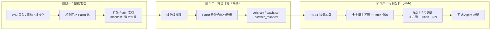

# 5 研究方法（系统模块与工作流程）

---

## 5.1 工作流程

如图所示，本系统的整体工作流程包括三个主要阶段。**第一阶段为图像数据管理**：对原始全切片图像（WSI）进行预处理，包括图像导入、格式标准化及切片质量检测等；系统在 level-0 像素坐标系下将 WSI 划分为固定尺寸的 Patch 网格（导出管线中常见 **512×512**、无重叠步长与 Patch 边长一致，具体以病例清单 `patchSize` 为准），并仅对**通过组织/质量筛选的有效 Patch** 建立索引与资源路径，从而形成后续分析与可视化的统一数据集。**第二阶段为算法计算**：对各 Patch 执行细胞级检测与分类及 Patch 级聚合，生成清单字段（如 `patchPredTps`、`patchPredBucket`、`num_cells`）及逐 Patch 细胞表等；该模块在离线流水线中独立完成，**具体网络结构与训练细节见 §5.2**，前端仅消费其导出结果。**第三阶段为多层级可视分析**：浏览器端基于 REST 接口按需加载清单与细胞数据，在 **金字塔瓦片视图—Patch 矢量叠加—统计与时序编码视图** 等多个尺度上联动展示，并支持 ROI 约束下的局部统计与可选的自然语言辅助交互。

上述三阶段在工程上形成 **「几何与索引一致 → 模型输出冻结 → 交互层只读消费」** 的链条：可视化中的 Patch 边界、ROI 吸附网格与清单坐标同源，避免统计单元与推理单元错位。

---

## 5.2 算法介绍

（本节由瑞琪补充，建议至少覆盖：**分割或切块策略与 Patch 筛选准则**、**细胞级检测/分类模型结构概要**、**Patch 级 TPS 与分级桶的定义及与临床判读阈值的对应**、**训练数据与验证协议摘要**。）

离线阶段在完成「WSI → Patch 集合」后，对每个有效 Patch 执行图像分析与指标计算；导出字段中与前端直接相关的包括：**连续标量 `patch_pred_tps`**、**离散桶 `patch_pred_bucket`**、**细胞表路径及 `num_cells`** 等。前端将 `patch_pred_tps` 映射为四档临床语义（1% / 10% / 50% 边界），与清单约定保持一致。

---

## 5.3 系统介绍（交互式可视化与分析）

本节对应前端 **`web-agent`** 已实现模块：自下而上依次为 **指标定义与派生计算（§5.3.1）**、**多层级视图编码（§5.3.2）**、**跨视图联动与智能辅助（§5.3.3）**。

### 5.3.1 指标计算

#### （1）临床分级建模（Clinical grading）

设 Patch 级连续预测为 \(\mathrm{pred}_p\in[0,1]\)（与清单字段 `patchPredTps` 一致）。系统在可视化层将其映射至临床常用的四个离散分级桶 \(\mathcal{B}\in\{\mathrm{Negative},\mathrm{TPS\_1},\mathrm{TPS\_10},\mathrm{TPS\_50}\}\)，阈值取 PD-L1 TPS 判读中广泛采用的 **1%、10%、50%** 分档：

\[
\mathcal{B}(p)=
\begin{cases}
\text{Negative}, & \mathrm{pred}_p<0.01,\\
\text{TPS\_1}, & 0.01\le \mathrm{pred}_p<0.10,\\
\text{TPS\_10}, & 0.10\le \mathrm{pred}_p<0.50,\\
\text{TPS\_50}, & \mathrm{pred}_p\ge 0.50.
\end{cases}
\]

该映射与前端函数 `patchBucketFromPredTps` 一致，用于 Patch 网格着色、画廊筛选及桶计数统计。

#### （2）多维度统计指标（Statistical metrics）

记清单中参与 TPS 聚合的 Patch 集合为 \(\mathcal{P}^+=\{p\,|\,n_p>0\}\)，\(n_p=\texttt{numCells}\)。

**全片级**：总细胞数 \(N_{\mathrm{cells}}=\sum_{p\in\mathcal{P}} n_p\)；全片 **Patch 均值型** TPS（对 \(\mathcal{P}^+\) 的算术平均）取 \(\overline{\mathrm{TPS}}_{\mathrm{patch}}=\frac{1}{|\mathcal{P}^+|}\sum_{p\in\mathcal{P}^+}\mathrm{pred}_p\)。此外，界面可用 \(\sum_p \mathrm{round}(\mathrm{pred}_p\cdot n_p)\) 近似「阳性细胞等价计数」以支撑 Cell mix 展示；须注意其与逐细胞阈值计数未必相等。

**ROI 局部加权**：用户框选矩形 ROI 并与 \(\mathcal{P}\) 求交得 \(\mathcal{P}_{\mathrm{ROI}}\)。**ROI 内 Mean TPS（细胞加权）**定义为
\[
\overline{\mathrm{TPS}}_{\mathrm{ROI}}=
\frac{\sum_{p\in\mathcal{P}_{\mathrm{ROI}}\cap\mathcal{P}^+} \mathrm{pred}_p\, n_p}
{\sum_{p\in\mathcal{P}_{\mathrm{ROI}}\cap\mathcal{P}^+} n_p},
\]
该式对应 **Selection ROI** 仪表盘在无全局阈值篡改前提下对局部负荷的客观聚合；ROI 边界经 **`patchSize` 网格吸附**，保证与推理网格同构。

#### （3）空间分布建模：Spatial Hilbert Trace

设 Patch \(p\) 在覆盖全体 Patch 外包络的最小 \(2^k\times 2^k\) 整数网格上的索引为 \((g_x^p,g_y^p)\)。Hilbert 曲线给出单一序号 \(d_p\in\mathbb{N}\)，满足空间填充曲线所具有的 **局部保邻近性**（邻近网格点在曲线上倾向邻近）。系统按 \(d_p\) 升序排列 Patch，在一维条带上以颜色编码 \(\mathrm{pred}_p\)，形成 **Spatial Hilbert Trace**。其方法学意义在于：将二维肿瘤表达格局压缩为一维 **序贯轨迹**，便于觉察「高表达区段是否沿序贯连续出现」，从而辅助讨论 **空间异质性**；同时须声明 Hilbert 路径 **不等于** 解剖切片上的真实扫描轨迹，条带为 **静态概览**，与精确定位仍以主视图 / 画廊为准。

---

### 5.3.2 多层级可视分析界面

#### （1）全局探索视图（WSI Main Viewer）

主视口采用 **OpenSeadragon** 实现 **多分辨率瓦片金字塔**，支撑千兆像素 WSI 下的连续缩放与平移。可选叠加 **TPS 加权二维 KDE**：在缩略图域对每个栅格中心累加 \(\sum_p w_p \exp(-\|(g_x,g_y)-(c_x^p,c_y^p)\|^2/(2\sigma^2))\)，\(w_p=\max(0,\mathrm{pred}_p)\)，\(n_p>0\) 的 Patch 参与；归一化后以 multiply 混合。**热力图刻画的是 Patch 尺度下的空间加权强度场**，用于直觉呈现 **肿瘤微环境层面表达集聚倾向**，而非单细胞分辨率的热力学含义。

另提供 **NavigationOverview**（缩略图 + 视口矩形）以降低全域漫游成本。

#### （2）分布关联视图（Distribution Overview）

该面板并联三类编码：**①** **101-bin（1% 步长）直方图**，刻画 \(\mathrm{pred}_p\) 在 \([0,100\%]\) 上的经验分布；全片与 ROI 均使用 **线性 0–100% 横轴**（等距 TPS%），全片下以 **垂直柱状频数** 呈现（不使用平滑密度曲线）。**②** **底部分档弱色带**：四档临床区间 \([0,1\%)\)、\([1,10\%)\)、\([10,50\%)\)、\([50,100\%]\) 在横轴上按 **临床跨度** 占宽（与线性 TPS% 一致），仅作读数参照；各档 **占比** 仍由直方图与右栏标量体现。**③** ROI 模式下直方图叠加 ROI 子分布，并与 **Selection ROI** 标量联动。

上述视图与 **Spatial Hilbert Trace** 同列于面板左侧，形成 **分布—序贯** 对照。

#### （3）局部细读与验证（Patch Gallery & Detail Card）

**Patch 画廊**支持按 \(\mathcal{B}(p)\) 筛选、按 \(\mathrm{pred}_p\) 升降序及分页；选中项更新全局 `selectedPatchId` 并触发主视口 **fly-to** 与细胞表请求。**Selected patch 详情区**采用 **双格预览带**：上下格分别渲染 **细胞类别叠加（cell_class）** 与 **连续概率 / 热力类图层（如 center_prob、heatmap_overlay）**，共享缩放平移，用于在 Patch 尺度 **对照离散标签与连续置信度**，辅助验证模型输出的可信度；下方卡片给出桶徽章、Patch pred TPS、基于 `cells.csv` 与可调阈值 \(\tau\) 的阴阳性统计（`computeCellStats`）。

---

### 5.3.3 智能交互

#### （1）交互联动机制（Interactive coordination）

系统在全局状态中维护 **病例—选中 Patch—ROI—画廊筛选—直方图桶选择** 等变量的耦合关系，形成典型 **三向联动**：（i）**画廊 ↔ 主视图**：点选缩略图驱动视口跳转与 Patch 高亮，主视图点击 Patch 同步画廊选中语义；（ii）**直方图 / 桶 ↔ 画廊**：临床桶点击可更新 `galleryBucket` 等过滤状态；（iii）**ROI ↔ 分布面板**：ROI 几何变更驱动直方图 ROI 模式与 Selection ROI 数值刷新。该机制支撑 **overview → filter → details-on-demand** 的探索路径，减少重复导航开销。

#### （2）LLM 驱动的辅助解释（AI-assisted pathologist）

**AiAssistantFloating** 以浮动按钮与可拖拽面板挂载于根布局，经 `/api/chat` 将 **当前病例元数据、选中 Patch、细胞级摘要** 等注入提示词，由大语言模型生成 **解释性文本**。设计上明确：**对话输出不反写清单或离线推理字段**，不承担替代病理诊断之职能；其作用定位在 **沟通、归纳与教学辅助**。若未来扩展「预定义问答槽位 + 结构化模板」，可作为可控性与可审计性的补充路径另行表述。

---

**小结**：§5.1—§5.3 构成「数据—算法—交互」完整链条；§5.3.1 给出 **可形式化的指标定义**，§5.3.2 对应 **金字塔—分布—细读** 三层界面，§5.3.3 强调 **状态驱动的联动与 LLM 边界**。
