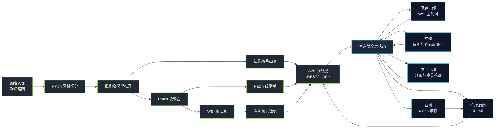

# 4 研究方法

本章阐述面向免疫组化（IHC）全切片图像（whole slide image, WSI）的 PD-L1 肿瘤比例评分（tumor proportion score, TPS）可视分析系统的研究方法。研究在「细胞级预测—Patch 级聚合—全片级统计」的多尺度推理结果之上，构建 Web 端多视图联动的人机协同分析流程，并引入大语言模型（large language model, LLM）作为辅助解释模块。全文依次从工作流程、核心算法与系统模块设计三个层次展开论述。

## 4.1 工作流程

本研究将分析任务分解为数据组织、离线推理、在线服务与交互式可视分析四个阶段。数据阶段以病例（case）为粒度组织 WSI 缩略图、Patch 级清单与逐 Patch 的细胞级导出结果；推理阶段在固定网格上对 Patch 进行细胞级检测与分类，并聚合得到 Patch 级与全片级 TPS 相关指标；服务阶段通过 Web API 按需暴露元数据与细胞表；可视分析阶段在浏览器中完成漫游、筛选、局部感兴趣区域（region of interest, ROI）统计与单 Patch 细读，并可调用 LLM 基于当前上下文生成辅助性文字说明。上述阶段之间的数据依赖与信息流向如图 1 所示。

**图 1　从 WSI 到可视分析前端的数据流与交互闭环**

具体而言，在数据组织层面，每一病例目录下保存全片缩略图、Patch 级清单文件（含各 Patch 的空间位置、预测 TPS、分级桶等字段），以及各 Patch 子目录中的切片图像、细胞级标注表与 Patch 元数据。在推理与聚合层面，细胞级模型对每个 Patch 内的候选细胞输出空间坐标与阴阳性相关概率，并依据导出规则写入细胞级结果表；在此基础上统计 Patch 内细胞数目，并计算 Patch 级预测 TPS 及其离散分级桶，进而汇总为全片平均 TPS、总细胞数及桶分布等统计量。在在线服务层面，客户端通过统一接口请求病例列表、病例清单、指定 Patch 的细胞表及静态图像资源，以实现延迟加载与带宽可控。在可视分析层面，客户端维护集中式应用状态，将当前病例、选中 Patch、ROI 几何与聊天会话等变量作为单一事实来源（single source of truth），驱动各视图模块的同步更新，从而形成「病例与集合定位—全片空间推理—分布与序贯对照—单 Patch 验证—文字归纳」的闭环工作流。

## 4.2 算法介绍

本节阐述细胞级检测与分类模型、Patch 级与全片级 TPS 聚合及分级策略等算法细节。**（本节内容由瑞琪补充，包括但不限于：网络结构、训练与验证数据、损失函数与优化设置、后处理与阈值标定、TPS 与分级桶的定义及与临床判读的对照。）**

## 4.3 系统模块设计及方法

本小节从人机界面布局与交互机制出发，对可视分析系统进行模块化描述。界面在垂直方向上划分为左、中、右三列；其中**中列**在垂直方向上再分为**上部**与**下部**两个相对独立的分析带：**上部**承载全分辨率 WSI 浏览及与空间位置强相关的叠加分析；**下部**承载与全片统计分布及一维空间序贯展开相关的对照视图。**左列**集中放置病例级入口与 Patch 集合级浏览，以降低用户在「换片」与「在集合中找 Patch」两类任务上的导航成本。**右列**保持为当前选中 Patch 的细读面板，用于在细胞—Patch 尺度上复核模型输出并与辅助问答联动。顶部另设全局病例切换控件；病理洞察（Pathology Insight）以可拖动浮动面板形式叠加于界面之上，与右列细读区通过统一状态变量协同显隐。整体设计遵循可视分析领域中「概览优先、过滤与聚焦、按需细化」（overview first, zoom and filter, details-on-demand）的经典范式。

### 4.3.1 左侧标本浏览与 Patch 画廊模块

在该模块中，**标本浏览器（Specimen Explorer）**与 **Patch 画廊（Patch Gallery）**以纵向堆叠方式布置于界面左缘，分别承担「病例级切换」与「当前病例内 Patch 集合浏览」两类互补任务，使用户能够在不离开主分析语境的前提下，完成从「选择待分析标本」到「在数千 Patch 中定位候选区域」的连续操作，从而为后续在中列主视图上开展空间推理提供稳定的任务入口。

具体而言，标本浏览器以卡片列表形式呈现服务器数据根目录下可扫描到的全部分析实例。每一卡片同步展示该病例的缩略图、病例标识符、由 Patch 清单聚合得到的平均 TPS，以及基于平均 TPS 划分的粗粒度表达水平标签（如高表达、中等、低表达等语义化表述），使用户在切换病例前即可形成对全片整体水平的先验印象。缩略图在固定尺寸的矩形区域内以**完整显示、等比缩放**的方式呈现，避免裁切造成的组织区域丢失；卡片外轮廓采用直角或弱圆角策略，以保证缩略图几何信息与真实切片长宽比一致的可读性。用户点击某一卡片后，系统触发病例级状态重置：清空上一病例的细胞级缓存、局部 ROI 与对话会话，重新加载当前病例的清单与主视图瓦片数据源，从而杜绝跨病例字段串扰。

Patch 画廊则面向**当前已加载病例**的 Patch 集合，支持按预测分级桶（bucket）筛选以及按预测 TPS 升降序排序，并以分页方式渲染 Patch 缩略图网格。与标本浏览器侧重「病例间比较」不同，Patch 画廊侧重「病例内 Patch 间比较与检索」：当用户在画廊中点选某一 Patch 时，系统将全局选中 Patch 标识更新为该 Patch，并驱动中列主视图执行视口导航（平移与缩放至对应切片坐标），同时触发右列细读面板的图像与指标刷新。该机制在信息架构上等价于建立了一条从「离散集合索引」到「连续物理空间」的确定性映射，使用户能够以低认知负荷的方式在浩大 Patch 集合中反复「试探—确认」感兴趣区域。

此外，为增强左列模块的可操作性，系统在标本浏览器顶部提供与数据目录扫描相关的刷新入口（如导入/刷新数据源），并在 Patch 画廊中通过分页控件与桶筛选控件显式暴露当前过滤状态，使用户始终能够感知「所见子集是否为全量 Patch 的子集」。上述交互与状态反馈共同支撑了左列作为**任务起点与集合导航枢纽**的角色定位。

### 4.3.2 中屏上部：WSI 主视图及 Patch 网格、TPS 核密度与 ROI 统计

中屏上部以**多分辨率瓦片渲染**技术实现 WSI 的深度缩放与平移，作为全片空间推理的「底图坐标系」。在该坐标系之上，系统依次叠加 **Patch 网格层**、**TPS 核密度热力图层**以及 **ROI 选取与统计** 三类语义图层，并在工具栏提供显式开关，使用户能够按分析阶段选择性地启用或关闭某一图层，从而在视觉复杂度与信息密度之间取得平衡。

**（1）Patch 网格层。**系统在底图上绘制与推理网格一致的 Patch 边界或填充多边形，并以离散色标对各 Patch 的预测分级桶进行编码（暖色表示高 TPS 桶、冷色或灰色表示低表达桶），使用户能够一眼辨识高表达区域在组织学空间上的聚集形态。网格层同时承担**空间选择器**功能：用户直接点击某一 Patch 即可将其设为全局选中对象，该操作与左列 Patch 画廊的点击在状态层面等价，从而保证「从集合进入」与「从地图进入」两条路径的一致性。

**（2）TPS 核密度热力图层。**为在视觉上连续刻画 Patch 级 TPS 的空间趋势，本系统在缩略图尺度上构建二维核密度估计（kernel density estimation, KDE）：以各 Patch 中心在缩略图坐标系下的投影为核中心，以各 Patch 的连续预测量 `patchPredTps`（取值于 \[0,1\]）为权重，对每个栅格像素累加高斯核贡献；随后对密度场进行全局最大值归一化，并通过由冷色向暖色过渡的连续色带映射至 RGBA 颜色，最终以正片叠底（multiply）混合模式叠加于组织图像之上。需要强调的是，该热力图表达的是**经空间平滑后的相对强度场**，用于揭示「高 TPS Patch 在空间上是否成簇」这一结构特征，而非将每个像素的显示值直接等同于某一 Patch 的 TPS 标量；该表述方式有助于避免读者在方法叙述中产生「热力图即逐 Patch 填色」的误解。

**（3）ROI 选取与统计。**用户在主视图上以矩形框选局部感兴趣区域时，系统将 ROI 边界**吸附**至 Patch 网格边界，以保证统计单元与推理单元一致。随后，系统在几何上与 ROI 相交的全部 Patch 子集上聚合细胞数、阴阳性计数及分级桶分布等统计量，并将结果呈现于可拖动的**选择摘要（Selection Summary）**浮层中；当未划定 ROI 时，该浮层退化为全片级汇总，以支持「先全局后局部」的阅读顺序。ROI 几何与统计结果写入全局状态后，进一步驱动中屏下部的 TPS 分布视图进入局部模式（见 4.3.3），实现跨垂直分带的统计一致性。

**（4）缩略导航（可选叠加）。**为降低大视场漫游时的空间迷失风险，主视图一角可叠加基于全片缩略图的导航概览组件：在缩略图上以高亮矩形标示当前视口范围，并支持点击缩略图将主视口平移至对应位置。该组件在信息角色上等同于电子地图中的鹰眼图，与上述三类语义图层正交，不改变 Patch 统计与 TPS 推断逻辑。

### 4.3.3 中屏下部：TPS 分布直方图与 Hilbert 空间条带

中屏下部由 **TPS 分布直方图（TPS Distribution Bar）**与 **Hilbert 空间条带（Hilbert Spatial Strip）**并列构成，用于在「概率轴统计」与「一维序贯空间」两个互补坐标系下审视 Patch 级 TPS 的整体格局及其与空间邻近性的关系，从而与中屏上部的二维组织学视图形成**统计—几何**对照。

**（1）TPS 分布直方图。**系统在 Patch 级预测 TPS 上采用 **1% 分箱**（即 101 个 bins 覆盖 \[0,100%\]）构建直方图，以较细的粒度呈现全片 TPS 的经验分布形态；在全局模式下，可叠加经平滑处理后的密度曲线，以辅助观察主峰、拖尾及高表达尾部的比重。当用户划定 ROI 且中列状态进入局部统计模式时，直方图切换为以 ROI 内 Patch 为主的频数展示，横轴在局部模式下采用**线性 0–100%**刻度，并与全片模式下的比例轴通过渐变过渡（axis blend）进行视觉衔接，以强调「局部子分布嵌入全局坐标」的读图逻辑；同时，在 ROI 模式下可对坐标轴刻度与图例进行简化，以降低小尺寸区域内的视觉拥挤。

**（2）Hilbert 空间条带。**二维 Patch 索引经 Hilbert 曲线映射为一维序贯索引后，沿条带方向以颜色编码各 Patch 的预测 TPS。由于 Hilbert 曲线具有保邻近性（space-filling 意义上的局部性保持），该条带有助于用户在**不直接观察组织学纹理**的前提下，快速发现高 TPS 区段在序贯索引上是否成段聚集，从而提示「空间上可能相邻的高表达簇」。当用户与 Hilbert 条带发生交互（若实现点击或 hover 联动）时，系统可将对应 Patch 映射回中屏上部主视图的视口位置，并与左列 Patch 画廊、右列细读面板保持选中状态一致，从而形成跨视图的闭环定位。

综上，中屏下部模块在方法学上承担了对中屏上部「连续组织空间」的**压缩与重参数化**功能：直方图压缩了「TPS 数值维度」，Hilbert 条带压缩了「二维空间维度」，二者共同为用户建立从统计异常到空间位置的假设生成路径。

### 4.3.4 右侧 Patch 细读与量化指标面板

右侧面板在布局上保持相对独立，用于承载**当前选中 Patch**的细胞级可视化结果与派生统计指标，其设计目标是在窄栏宽度约束下最大化「可复核证据」的信息量。面板在垂直方向上划分为**预览带**与**指标卡**两部分：预览带以上下两格等尺寸正方形区域分别展示细胞类别叠加图与阳性概率热力图（或等价的模型输出可视化图层），两格共享同一套缩放与平移变换状态，以保证用户在比较「离散标签」与「连续概率」时视线切换成本最小；指标卡依次呈现预测分级桶、Patch 与全片细胞总数之比、Patch 级预测 TPS（辅以条形进度编码）以及基于细胞级导出表中离散标签字段统计得到的阴阳性细胞计数与比例条带。右栏宽度可与预览正方形边长按比例联动，以避免预览区与栏宽不一致导致的水平留白或裁切歧义。

此外，右列与**病理洞察**模块在交互上保持耦合：系统在 Patch 细读区与浮动入口提供等价的「打开/关闭洞察」控件，并由全局布尔状态统一驱动浮动面板显隐；当面板开启时，服务端在提示构造中注入当前病例元数据、选中 Patch 标识及其细胞级汇总统计，以支持多轮对话式解释。该设计使右列不仅承担「读数」功能，还承担「发起语言化归纳」的触发点角色。

### 4.3.5 全局控制、数据解析与跨模块一致性

顶部全局控制区提供应用标题与病例切换下拉控件，其语义与左列标本浏览器中的病例切换一致，二者任一操作均触发相同的病例级重置逻辑。客户端在接收到清单与细胞表后，将其解析为类型化的数据结构，并在此基础上计算直方图、Hilbert 索引、KDE 采样场及 ROI 聚合等派生量。全系统对 PD-L1 分级桶采用统一的离散色标与徽章样式，以保证 Patch 网格、画廊缩略图、Hilbert 条带与右列指标在颜色语义上的一致性，从而降低跨视图解码成本。

**表 1　典型用户操作与系统响应**

| 用户操作 | 主要涉及模块 | 系统响应 |
| --- | --- | --- |
| 切换当前病例 | 顶部控制、标本浏览器 | 清空并重新加载病例元数据与细胞缓存；重置 ROI 与对话；主视图载入新 WSI |
| 在 Patch 画廊中选择某一 Patch | Patch 画廊 | 更新全局选中 Patch；主视图导航至对应空间位置；右栏刷新预览与指标 |
| 在主视图上点击 Patch 或划定 ROI | Patch 网格层、ROI 选取器 | 更新选中 Patch 或 ROI 几何与局部统计；下带 TPS 直方图切换全局/局部模式 |
| 开启或关闭 TPS 热力图 | 主视图工具栏、KDE 叠加层 | 挂载或卸载热力图画布叠加层 |
| 打开病理洞察面板 | 浮动入口、右列入口 | 同步面板显隐；向服务端提交含当前上下文的多轮对话请求 |

综上，本研究所实现的系统在算法输出与病理学家解读之间插入了一层结构化的可视分析界面：左列负责病例与集合级入口，中列上、下两带分别承担空间推理与统计—序贯对照，右列承担单 Patch 证据复核与语言化辅助的触发。该模块划分与叙述方式与「分功能区描述方法—给出机制—补充交互」的论文写作惯例相一致，便于在正式稿件中与整体章节编号对齐。
